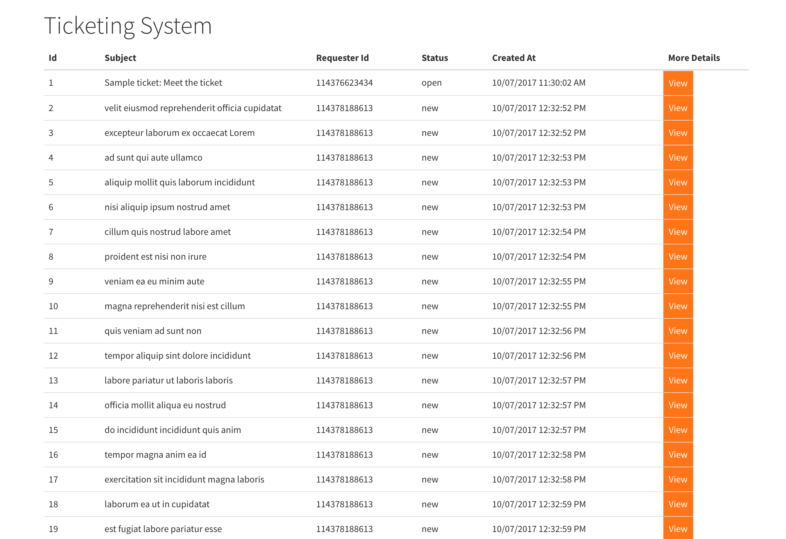
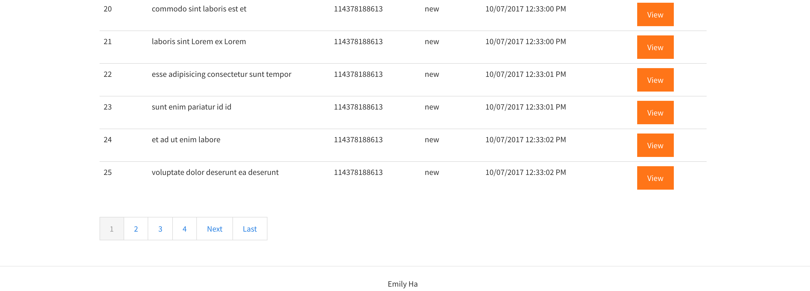
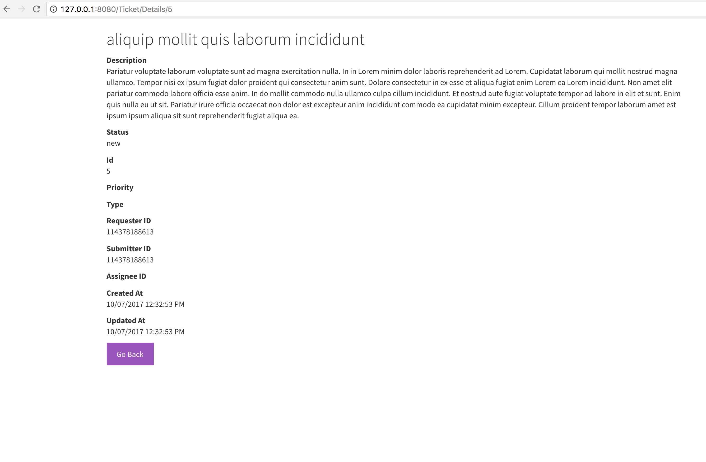

TicketingSystemZD
 

Pagination:

View of ticket:

Requirements:
- ASP.NET Version: 4
- ASP.NET MVC Version: 5
- Visual Studio 2017

How to run the app:
1. Open the .sln file named 'TicketingSystemZD.sln'
2. Build TicketingSystemZD (Command + K)
3. Press the Play Button icon on the top left corner or alternatively under the 'Run' tab, select 'Start without debugging'.
4. You should be redirected to the web application.

How to run the tests:
1. Double click on the TicketingSystemZD.Tests Project from the Solution Explorer.
2. Under the 'Run' tab, select 'Run Unit Tests'
3. Open the tab ' Test Results' located near the bottom right hand corner of the IDE.

IMPROVEMENTS NEEDED:
- The web api request needs a complete revamp. 
- Index method needs a rewrite.
- Needs negative testing in unit tests.
